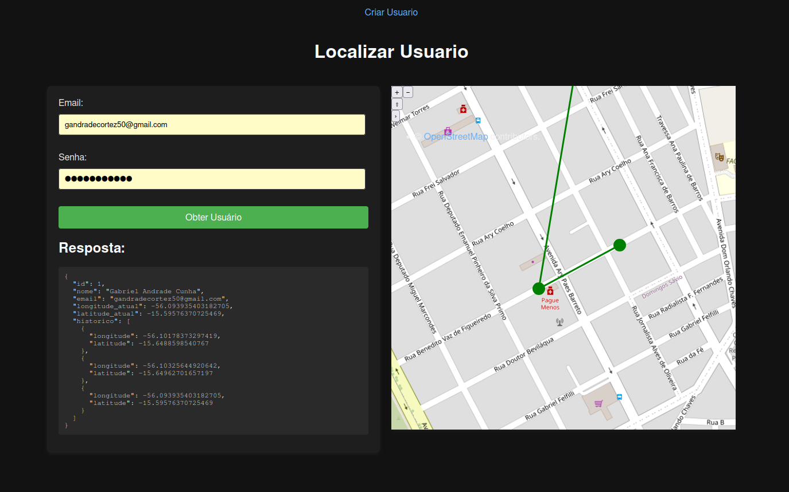

# Sistema GIS/IoT de rastreamento de veiculos em tempo real com Spring Boot, OpenLayers, MQTT e Docker 

Sistema de rastreamento veicular desenvolvido com backend em Spring Boot, utilizando o protocolo MQTT para comunicação entre microcontroladores ESP32 e o sistema. As coordenadas dos veículos são persistidas em banco de dados e exibidas em um mapa interativo por meio do GeoServer e da biblioteca OpenLayers.

<i> Vehicle tracking system developed with a Spring Boot backend, using the MQTT protocol for communication between ESP32 microcontrollers and the system. Vehicle coordinates are stored in a database and displayed on an interactive map using GeoServer and the OpenLayers library. </i>



# Visão geral da arquitetura

O sistema é composto por um backend em Spring responsável pela ingestão e disponibilização dos dados, um banco de dados PostgreSQL com lógica automatizada de histórico, um script de coleta via MQTT e um frontend para visualização geográfica das informações.

O fluxo funciona da seguinte forma: dispositivos enviam coordenadas via MQTT, um script Python consome essas mensagens e persiste os dados no banco PostgreSQL. Funções e triggers no banco garantem o registro automático do histórico de localização por usuário. O backend Spring fornece endpoints REST para consulta dessas informações, que são renderizadas no frontend em um mapa interativo.

# Componentes do sistema

- **Banco PostgreSQL:** executar o script `init.sql` no banco de dados. Ele cria uma função e um trigger responsáveis por inserir automaticamente, na tabela `history_location`, a localização do usuário armazenada na tabela `users`.

- **Backend Spring Boot:** aplicação responsável por expor as rotas REST para criação de usuários e consulta do histórico de coordenadas. Esses dados são consumidos pelo frontend para exibição do mapa de localizações.

- **Script Python MQTT/DB** conecta-se ao broker MQTT, consome mensagens em JSON contendo coordenadas, realiza o tratamento dos dados e os insere no banco de dados. A partir disso, o histórico de localização do usuário é persistido automaticamente.

- **Frontend com OpenLayers:** frontend desenvolvido com HTML, CSS e JavaScript, utilizando a biblioteca JavaScript OpenLayers e o servidor de mapas GeoServer (em container Docker) para renderizar no mapa as localizações dos usuários, representadas como pontos.

# Easy Setup

Subir PostgreSQL e GeoServer (servidor de mapas) com Docker Compose:
```bash
sudo docker-compose up -d
```

Executar script para o banco de dados PostgreSQL:
```bash
sudo docker exec -it postgres_rastreamento psql -U postgres -d rastreamento -f /docker-entrypoint-initdb.d/init.sql
```

Rodar o backend Spring Boot diretamente:
```bash
cd api/
mvn clean install
mvn spring-boot:run
```
ou executar .jar
```bash
cd api/
java -jar api_rastreamento.jar
```

## Fico à disposição para esclarecimentos adicionais.